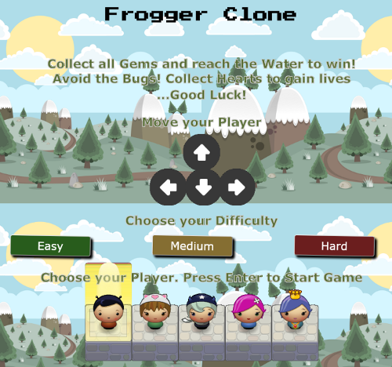
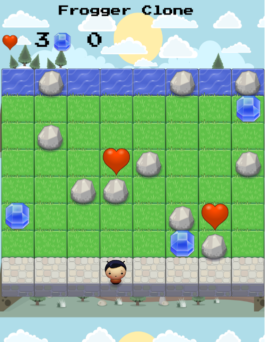

#Classic Arcade Game Clone – “Frogger Clone"

### Project Requirements

You will be provided with visual assets and a game loop engine;
using these tools you must add a number of entities to the game including the
player characters and enemies to recreate the classic arcade game Frogger.

### How to Run the Game

Download the repository in your desktop, unzip it and open the "index.html"
file in your browser to play the game.

ONLINE VERSION of the project: [https://asalcedo07.github.io/udacity-arcade-game/](https://asalcedo07.github.io/udacity-arcade-game/)

### How to Play the Game

- Use your mouse to click on a difficulty level. Easy, Medium or Hard.
- Use the arrows to highlight which player you wish to use.
- Press Enter to choose your player and start the game.
- To play the game, use the arrow keys from your keyboard to move your player.

### Game Rules

-	Goal is to collect all Gems and reach the water.
- You cannot move through rocks, but bugs can.
-	Avoid touching bugs.
-	If you touch a bug you lose a life, if you have no lives the game is over.
- You can pick up Heart(s) to increase your lives by +1.  

### Udacity's Instructions

<a href= "https://www.udacity.com/course/front-end-web-developer-nanodegree--nd001">Tell me more about Udacity's Front-End Web Developer Nanodegree.</a>

- If you need a refresher on Object Oriented JavaScript, review our course and OOJS Notes; if you'd like a more detailed explanation as to how the game engine works, see our HTML5 Canvas course.
-Make sure the functions you write are **object-oriented** - either class functions (like Player and Enemy) or class prototype functions such as Enemy.prototype.checkCollisions, and that the keyword 'this' is used appropriately within your class and class prototype functions to refer to the object the function is called upon.
- Read the detailed instructions for the project.
-Students should use this [rubric](https://review.udacity.com/#!/projects/2696458597/rubric) for self-checking their submission
-  Download the art assets and provided game engine.
-  Review the video of the completed game and take note of the game's rules.
-  Review the code and comments provided in app.js
-  Identify the various classes you will need to write.
-  Identify and code the properties each class must have to accomplish its tasks.
-  Write the functions that provide functionality to each of your class instances.

### Attributions

Game engine.js and resources.js by <a href="https://www.udacity.com/">Udacity</a>

Background Game Art by <a href='http://opengameart.org/content/2d-backgrounds-set' target='_blank'>Alucard</a> 2D Backgrounds Set (opengameart.org)

Game sounds by <a href='http://opengameart.org/content/8-bit-sound-effects-library' target='_blank'>LittleRobotSoundFactory</a> 8 bit sound effects Library (opengameart.org)

### License

The project is licensed under the [MIT license](license.txt).
